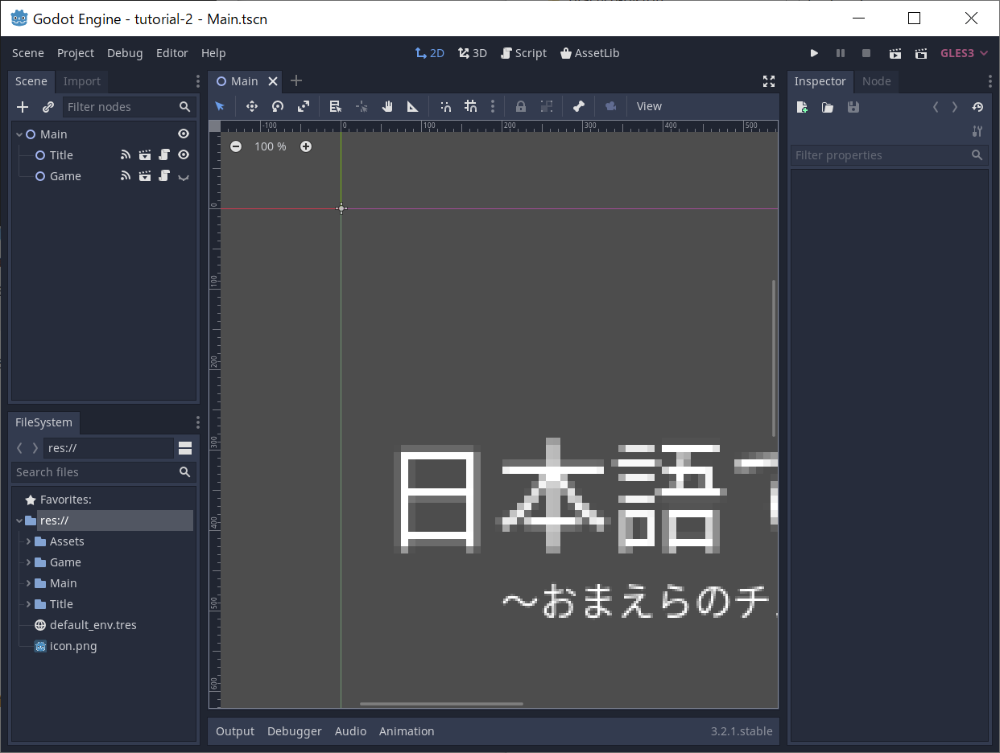

# godot-tutorials

海外製ゲームエンジン Godot の使い方を日本語しか使えないお前らにこのわたしが教えてやらなくてはいけないとはな……☆（＾～＾）  

## tutorial-1

  
シグナルの使い方をマスターしろだぜ☆（＾～＾） エディターの下側の Output 欄をよく見ろだぜ☆（＾～＾）  

## tutorial-2

  
* 日本語フォント入れたかったら、これを読めだぜ☆（＾～＾）！ .ttf ではなくて、 .otf な☆（＾～＾）！  
[UIコントロールを日本語化する](http://puggygame.blogspot.com/2018/12/ui.html)  
[otf](https://www.google.com/get/noto/help/cjk/)  
